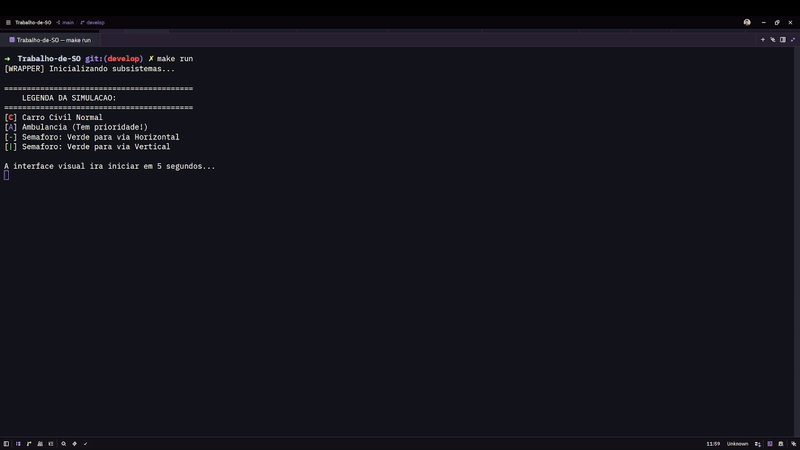

# PthreadTraffic

[](https://github.com/LeoncioFerreira/Trabalho-de-SO/actions)
[](<https://en.wikipedia.org/wiki/C_(programming_language)>)
[](https://en.wikipedia.org/wiki/POSIX_Threads)
[](LICENSE)

Simulador concorrente de tráfego urbano desenvolvido em C utilizando a biblioteca POSIX Threads (Pthreads). A aplicação simula de forma concorrente e visual (console ASCII) o movimento de veículos civis e de emergência disputando células da via, com cruzamentos coordenados por semáforos, prevenção contra travamentos (deadlocks) e renderização via duplo buffer em tempo real.

## 🎬 Demonstração



> Demonstração em tempo real do simulador de tráfego urbano: cruzamentos, semáforos, movimento de veículos e prioridade da ambulância. Versão em vídeo (`.webm`) também disponível em [`docs/video.webm`](docs/video.webm).

---

## 📄 Artefatos

- **Relatório Técnico:** [`Relatorio_SO_Equipe_Leôncio.pdf`](docs/Relatorio_SO_Equipe_Leôncio.pdf)
- **Integrantes e Responsabilidades:** [`Lista_Integrantes_Responsabilidades.pdf`](docs/Lista_Integrantes_Responsabilidades.pdf)

---

## 👨💻 Equipe

| Nome                                 | GitHub                                                 |
| ------------------------------------ | ------------------------------------------------------ |
| Leôncio Ferreira Flores Neto         | [@LeoncioFerreira](https://github.com/LeoncioFerreira) |
| Paulo Gabriel Leite Landim           | [@LandimPG](https://github.com/LandimPG)               |
| Salomão Rodrigues Silva              | [@salomaosilvaa](https://github.com/salomaosilvaa)     |
| André Wesley Barbosa Rodrigues Filho | [@awesleyy](https://github.com/awesleyy)               |

---

## 📋 Controle de Issues e Tasks

Abaixo está a tabela de acompanhamento e controle de todas as issues desenvolvidas no projeto, com links diretos para seus critérios de aceite e detalhes técnicos:

|    Semana    | Paulo                                                                                                             | Salomão                                                                                                       | Leôncio                                                                                                                       | André                                                                                                                      |
| :----------: | :---------------------------------------------------------------------------------------------------------------- | :------------------------------------------------------------------------------------------------------------ | :---------------------------------------------------------------------------------------------------------------------------- | :------------------------------------------------------------------------------------------------------------------------- |
| **Semana 1** | Parser de mapa e inicialização da malha viária ([#1](https://github.com/LeoncioFerreira/PthreadTraffic/issues/1)) | Módulo de Relógio (Sincronização Temporal) ([#2](https://github.com/LeoncioFerreira/PthreadTraffic/issues/2)) | Lógica base de movimento e ciclo de vida de Veículos ([#3](https://github.com/LeoncioFerreira/PthreadTraffic/issues/3))       | Orquestração central e integração de módulos (`main.c`) ([#4](https://github.com/LeoncioFerreira/PthreadTraffic/issues/4)) |
| **Semana 2** | Módulo de Semáforos (`traffic`) ([#9](https://github.com/LeoncioFerreira/PthreadTraffic/issues/9))                | Módulo de Visualização ASCII (`display`) ([#12](https://github.com/LeoncioFerreira/PthreadTraffic/issues/12)) | Sistema de Ambulância e Prioridade ([#11](https://github.com/LeoncioFerreira/PthreadTraffic/issues/11))                       | Estratégia Anti-Deadlock ([#10](https://github.com/LeoncioFerreira/PthreadTraffic/issues/10))                              |
| **Semana 3** | Sincronização de Tráfego ([#27](https://github.com/LeoncioFerreira/PthreadTraffic/issues/27))                     | Geração Dinâmica de Veículos ([#26](https://github.com/LeoncioFerreira/PthreadTraffic/issues/26))             | Refatorações e Acoplamento (`refactor/simulation-fixes`) ([#28](https://github.com/LeoncioFerreira/PthreadTraffic/issues/28)) | Módulo de Logging Concorrente ([#25](https://github.com/LeoncioFerreira/PthreadTraffic/issues/25))                         |
| **Semana 4** | Concorrência e Bugs de Interface ([#29](https://github.com/LeoncioFerreira/PthreadTraffic/issues/29))             | —                                                                                                             | Escrita e Finalização do Relatório Técnico ([#30](https://github.com/LeoncioFerreira/PthreadTraffic/issues/30))               | —                                                                                                                          |

> 🔗 **GitHub Project:** Acompanhe o andamento das tarefas e o quadro Kanban diretamente no [GitHub Projects do Projeto PthreadTraffic](https://github.com/users/LeoncioFerreira/projects/4)

---

## 🏗️ Estrutura do Projeto

O projeto segue uma estrutura de **Monolito Modular**, onde cada subsistema é isolado em sua própria pasta dentro de `modules/`.

```text
.
├── Makefile                # Automação de compilação
├── README.md               # Documentação e regras do projeto
├── TASKS.md                # Cronograma e tarefas semanais
├── .gitignore              # Arquivos ignorados pelo Git
├── mapa.txt                # Configuração da malha viária (entrada)
├── docs/                   # Especificações de design e relatórios
│   ├── initial_design.md   # Design inicial do projeto
│   └── relatorio/          # Artigo e figuras do relatório técnico
├── src/
│   ├── main.c              # Inicialização, loop e orquestração principal
│   └── modules/            # Núcleo Modular da Simulação
│       ├── ambulance/      # Lógica e controle de prioridade da Ambulância
│       ├── clock/          # Módulo do Relógio Global discreto em ticks
│       ├── deadlock/       # Estratégias anti-deadlock (como Look-Ahead)
│       ├── display/        # Motor de renderização em console (Double Buffering)
│       ├── initializer/    # Módulo de inicialização e tratamento de sinais
│       ├── logger/         # Módulo de logging concorrente do simulador
│       ├── map/            # Parser e representação matricial do mapa.txt
│       ├── navigation/     # Navegação discreta e direção das faixas
│       ├── spawner/        # Gerenciamento dinâmico de geração (spawn) de veículos
│       ├── traffic/        # Gerenciamento concorrente dos semáforos
│       └── vehicle/        # Estrutura e thread do ciclo de vida do veículo
└── tests/                  # Testes Unitários (Unity Framework)
    ├── ambulance.test.c    # Testes de prioridade e liberação da ambulância
    ├── clock.test.c        # Testes do relógio global e emissão de ticks
    ├── display.test.c      # Testes da renderização síncrona/duplo buffer
    ├── example.test.c      # Teste de sanidade geral do framework
    ├── map.test.c          # Testes de carga do arquivo mapa.txt e limites
    ├── navigation.test.c   # Testes das regras de vias e radares de cruzamento
    ├── traffic.test.c      # Testes de semáforo (capacidade e espera bloqueante)
    ├── vehicle.test.c      # Teste do ciclo de vida e movimento dos veículos
    └── vendor/             # Framework Unity para testes em C
```

## 📜 Regras de Desenvolvimento

### Idioma e Documentação

- **Código:** Todo o código (nomes de arquivos, variáveis, funções) deve ser em **Inglês**.
- **Docstrings:** Todo arquivo deve ter um cabeçalho em **Português**:
  ```c
  /**
   * Descrição: O que este arquivo faz.
   * Autor: Nome do Autor
   */
  ```

### Git e Fluxo de Trabalho

- **Branches:** As funcionalidades devem ser desenvolvidas em branches `feature/` e enviadas para a `develop`. A branch `main` contém apenas código estável.
- **Commits:** Seguimos o padrão de **Conventional Commits** (Prefixo em Inglês, Mensagem em Português).
  - **Padrão:** `<prefixo>: <mensagem>`
  - **Exemplo Real:** `feat: adiciona lógica de movimento do veículo`
  - **Tipos comuns:**
    - `feat: ...` (Funcionalidades)
    - `fix: ...` (Correções)
    - `docs: ...` (Documentação)
    - `refactor: ...` (Refatoração)
- **Revisão de Código:** Usamos assistentes de IA (como GitHub Copilot) para realizar o *double check* nos Pull Requests (PRs) antes da aprovação final.

## 🚀 Como Compilar e Executar

Compile o projeto e execute o simulador no terminal com os comandos padrão:

```bash
make       # Compilação do executável em bin/
make run   # Execução padrão (15 veículos máximos, clock de 1000ms, mapa.txt)
```

Para customizar a simulação sem recompilar, execute o binário diretamente com as flags:

```bash
./bin/simulador [-v veiculos] [-t tick_ms] [-m mapa.txt]
```

- `-v <int>`: Limite de veículos simultâneos (padrão: `15`).
- `-t <int>`: Período do relógio global em ms (padrão: `1000`).
- `-m <string>`: Caminho do mapa de entrada (padrão: `mapa.txt`).

Exemplo: `./bin/simulador -v 20 -t 500 -m mapa.txt`

---

## 🧪 Testes Unitários e Qualidade de Código

### Cobertura de Testes

Desenvolvemos exatamente **23 testes unitários** utilizando o framework **Unity** para garantir a corretude dos algoritmos concorrentes e evitar regressões. A suíte valida a inicialização do relógio global, o parser e tratamento de limites do mapa, as regras de navegação e colisões, a integridade física dos semáforos, o ciclo de vida das threads dos veículos e o controle de prioridade e liberação segura da ambulância.

Para rodar todos os testes unitários:

```bash
make test
```

### Linter e Qualidade

- **Linter (`cppcheck`):** Rastreia concorrência e vazamentos (`make lint`).
- **Formatador (`clang-format`):** Padroniza a formatação do código (`make format`).
- **Limpeza (`clean`):** Remove binários e arquivos objetos intermediários (`make clean`).

---

## ⚙️ Pipeline de Integração Contínua (CI)

O repositório utiliza **GitHub Actions** (`.github/workflows/ci.yml`) para Integração Contínua (CI). O pipeline roda a cada push ou pull request nas branches `main` e `develop`, executando automaticamente o linter (`make lint`), a validação de formatação (`clang-format`) e os 23 testes unitários (`make test`).
